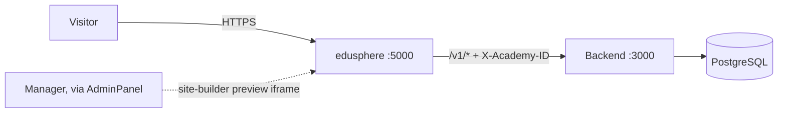
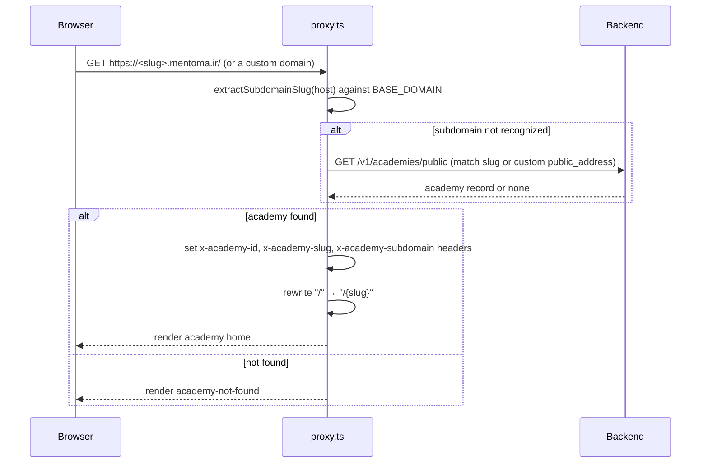
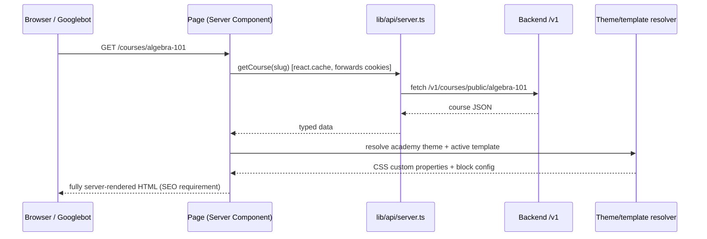
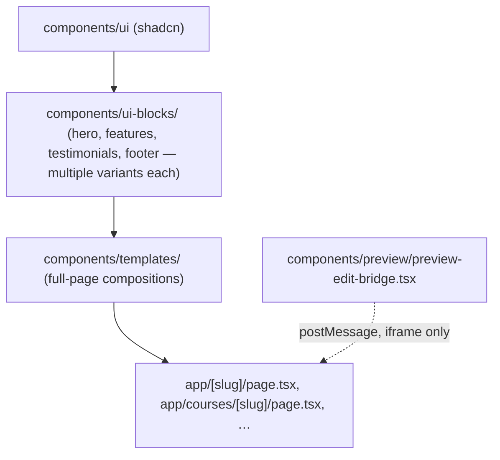
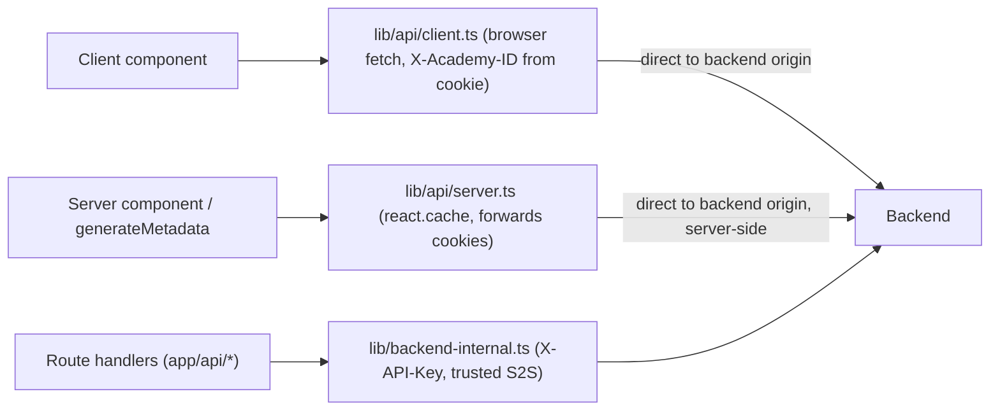
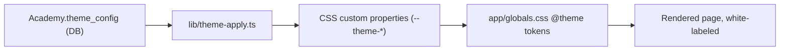

# Architecture — edusphere

Full business context: `docs/project-context.md`. This file is the technical map.

## System context

## Tenant resolution: proxy.ts

Platform marketing pages (`app/(platform)/*`) are the no-academy-context path — `proxy.ts` leaves them alone.

## Request → render (server-first)

## Component layering

## Data layer — two fetchers

## Theming

## System design: exists / partial / planned

| Concern                                  | Status   | Where                                                                                                                            |
| ---------------------------------------- | -------- | -------------------------------------------------------------------------------------------------------------------------------- |
| Tenant/subdomain resolution              | Exists   | `proxy.ts`                                                                                                                       |
| Server-rendered SEO                      | Exists   | enforced by convention + `lib/seo/`                                                                                              |
| White-label theming                      | Exists   | `lib/theme-apply.ts`, `app/globals.css`                                                                                          |
| Site builder live preview                | Exists   | `components/preview/preview-edit-bridge.tsx`                                                                                     |
| hreflang / multi-market (IR/COM)         | Partial  | `lib/seo/domains.ts`, `market-link.ts` — COM/English content is phase 2, not fully localized                                     |
| Checkout / payment                       | Exists   | `app/checkout`, `app/payment`, backed by Backend payment-providers                                                               |
| Guest quick enroll (live class)          | Exists   | `components/courses/quick-enroll/` — phone + OTP dialog on the course page; `?class=<id>` resumes into checkout after the reload |
| Client/server API fetcher de-duplication | Not done | `lib/api/{client,server}.ts` still duplicate a lot of endpoint logic — target layout in the Backend repo's split notes           |

## Owner map — update these docs when you touch these paths

| Change                                                       | Update                                                                                |
| ------------------------------------------------------------ | ------------------------------------------------------------------------------------- |
| `proxy.ts`                                                   | Tenant-resolution diagram                                                             |
| `lib/api/{client,server}.ts` structure                       | Data-layer diagram                                                                    |
| `lib/theme-apply.ts`, theme token shape                      | Theming diagram                                                                       |
| A new `components/templates/` or top-level `ui-blocks/` type | Component layering                                                                    |
| `lib/seo/**`                                                 | `seo-marketing-expert` skill (not this file — that skill is the living SEO reference) |

Update `docs/ONBOARDING.md` too whenever a command, env var, or gotcha changes.
